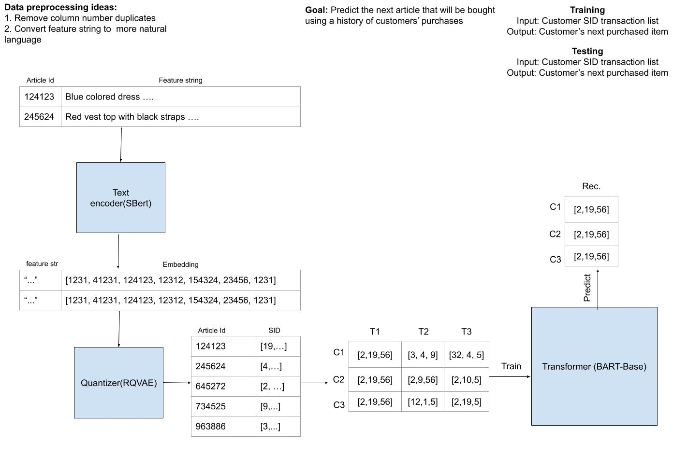

# Generative Recommender System

A Generative Recommender System pipeline for generating product recommendations for the [H&M dataset](https://www.kaggle.com/competitions/h-and-m-personalized-fashion-recommendations).

## Pipeline Architecture


## Contains
The repository consists of
 - ```data/```: where the H&M dataset should be
 - ```embeddings/```: where the embeddings should be stored
 - ```semantic_ids/```: where the semantic IDs should be stored
 - ```models/```: where the trained models should be stored
 - ```components/```: source code for main system building blocks (embedder, quantizer, and transformer)
 - ```data_utils/```: scripts for data handling and analysis
 - ```eval/```: includes a baseline model and model evaluation scripts
 - ```train/```: training scripts for components
 - ```pipeline.ipynb```: pipeline for the entire generative recommender system

## Prerequisites
This project is known to work with Python 3.12 and 3.13.  

The dependencies for the project can be acquired by letting your environment run:
```
pip install -r requirements.txt
```

Before running ```pipeline.ipynb```, make sure that ```articles.csv```, ```customers.csv```, and ```transactions_train.csv``` from the H&M dataset are present directly in the ```data/``` directory.

## Structure
```
root/
├── data/
│   ├── embeddings/
│   │   └── ...
│   │
│   ├── semantic_ids/
│   │   └── ...
│   │
│   └── ...
│
├── docs/
│   └── architecture/
│       └── GR_Architecture.jpg
│
├── models/
│   ├── bart/
│   │   └── ...
│   │
│   └── rqvae/
│       └── ...
│
├── src/
│   ├── components/
│   │   ├── __init__.py
│   │   ├── embedder.py
│   │   ├── quantizer.py
│   │   └── transformer.py
│   │
│   ├── data_utils/
│   │   ├── __init__.py
│   │   ├── data_analyzer.py
│   │   └── data_handler.py
│   │
│   ├── eval/
│   │   ├── baseline/
│   │   │   ├── __init__.py
│   │   │   └── collaborative_filtering.py
│   │   │
│   │   ├── __init__.py
│   │   ├── cosine_similarity.py
│   │   ├── evaluation.py
│   │   └── loss_plot.py
│   │
│   ├── train/
│   │   ├── __init__.py
│   │   ├── quantizer_train.py
│   │   └── transformer_train.py
│   │
│   └── pipeline.ipynb
│
├── .gitignore
├── README.md
└── requirements.txt
```

## Contact
<table>
  <tr><td>Mostafa Aziz Zuher</td><td><a href="mailto:mostafaaziz510@yahoo.se">mostafaaziz510@yahoo.se</a></td></tr>
  <tr><td>Roy Liu</td><td><a href="mailto:royliu.ruirui@gmail.com">royliu.ruirui@gmail.com</a></td></tr>
  <tr><td>Serkan Anar</td><td><a href="mailto:serkan.anar24@gmail.com">serkan.anar24@gmail.com</a></td></tr>
  <tr><td>Mahdi Nazari</td><td><a href="mailto:Mahdi.Nazari1999@gmail.com">Mahdi.Nazari1999@gmail.com</a></td></tr>
</table>
